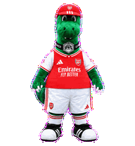
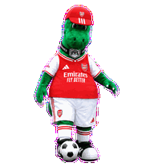
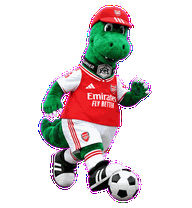
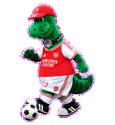

# CodexPet Arsenal Gunnersaurus Rex

> A personal-use-only Codex pet inspired by the green dinosaur matchday mascot in the supplied references. This is a fan-made, non-commercial asset and is not affiliated with, endorsed by, or licensed by Arsenal Football Club, Adidas, Emirates, or their partners.
>
> 基于用户提供的绿色恐龙比赛日吉祥物参考制作的仅供个人使用 Codex 宠物。该项目为非商业同人作品，不隶属、未经阿森纳足球俱乐部、Adidas、Emirates 或其合作方认可或授权。



## Highlights / 亮点

- Full Codex v2 pet atlas: 8 columns × 11 rows, 1536 × 2288 RGBA WebP.
  完整 Codex v2 精灵图：8 列 × 11 行，1536 × 2288 RGBA WebP。
- Faithful plush green-dinosaur silhouette, red-and-white kit treatment, and front/rear kit details.
  保留绿色毛绒恐龙轮廓、红白球衣风格，以及正反面服装细节。
- Low-frequency idle loop: breathing, soft claw flex, and light toe/weight movement.
  低频待机循环：呼吸、轻微手爪收放与脚尖/重心变化。
- Working loop: a single-football juggling sequence from toe to waist and back.
  工作循环：单颗足球从鞋尖颠至腰际再回落。
- Left/right motion loops: independent ground-dribble animations, including correctly oriented `GUNNER 99` rear frames.
  左右移动循环：独立生成的贴地带球动画，并保留朝向正确的 `GUNNER 99` 背面帧。

## Previews / 动作示意

| State / 状态 | Preview / 示意 |
| --- | --- |
| Idle / 待机 |  |
| Working — juggling / 工作—颠球 |  |
| Move right — dribble / 向右移动—带球 |  |
| Move left — dribble / 向左移动—带球 |  |

For every state, see [`previews/`](previews/). For the complete atlas, see [`assets/contact-sheet.png`](assets/contact-sheet.png).

全部动作见 [`previews/`](previews/)，完整精灵图见 [`assets/contact-sheet.png`](assets/contact-sheet.png)。

## Install / 安装

1. Copy `pet/pet.json` and `assets/spritesheet.webp` to a Codex pet folder named `gunnersaurus-rex`.
   将 `pet/pet.json` 与 `assets/spritesheet.webp` 复制到名为 `gunnersaurus-rex` 的 Codex 宠物目录。
2. In Codex, open **Settings → Pets**, refresh the list, and select **Gunnersaurus Rex**.
   在 Codex 中打开 **设置 → 宠物**，刷新列表后选择 **Gunnersaurus Rex**。

> Codex installation paths and UI wording can vary by release. This repository packages the pet asset; it does not modify settings automatically.
>
> Codex 的安装路径和界面文字可能随版本变化。本仓库仅提供宠物资产，不会自动修改你的设置。

## Repository layout / 仓库结构

```text
assets/       final spritesheet and static contact sheet / 最终精灵图与静态总览
pet/          Codex pet manifest / Codex 宠物配置
previews/     animated GIF previews / 动态 GIF 示意
qa/           structural validation result / 结构校验结果
docs/         bilingual project and rights notes / 中英双语项目与权利说明
```

## Validation / 校验

The included `qa/validation.json` records a successful v2 validation: RGBA WebP, 8 × 11 cells, 1536 × 2288 pixels, and no transparent-RGB residue.

随附的 `qa/validation.json` 记录了成功的 v2 校验：RGBA WebP、8 × 11 单元格、1536 × 2288 像素，且不存在透明 RGB 残留。

## Rights and source boundary / 权利与素材边界

- No raw source photographs, including watermarked or agency images, are distributed in this repository.
  本仓库不分发原始参考照片，包括含水印或图片机构素材。
- Team, sponsor, and manufacturer marks shown in the fan asset remain the property of their respective owners.
  同人资产中出现的球队、赞助商与制造商品牌标记均归其各自权利人所有。
- Do not use this repository for commercial distribution, merchandising, or as an implication of official affiliation.
  请勿将本仓库用于商业分发、周边销售，或暗示存在官方合作关系。
- Personal use only; do not redistribute the included asset as your own work.
  仅限个人使用；请勿将所含资产作为自己的作品再次分发。

See [`docs/PROJECT_SCOPE.md`](docs/PROJECT_SCOPE.md) for the bilingual project record.

详见双语项目说明 [`docs/PROJECT_SCOPE.md`](docs/PROJECT_SCOPE.md)。
